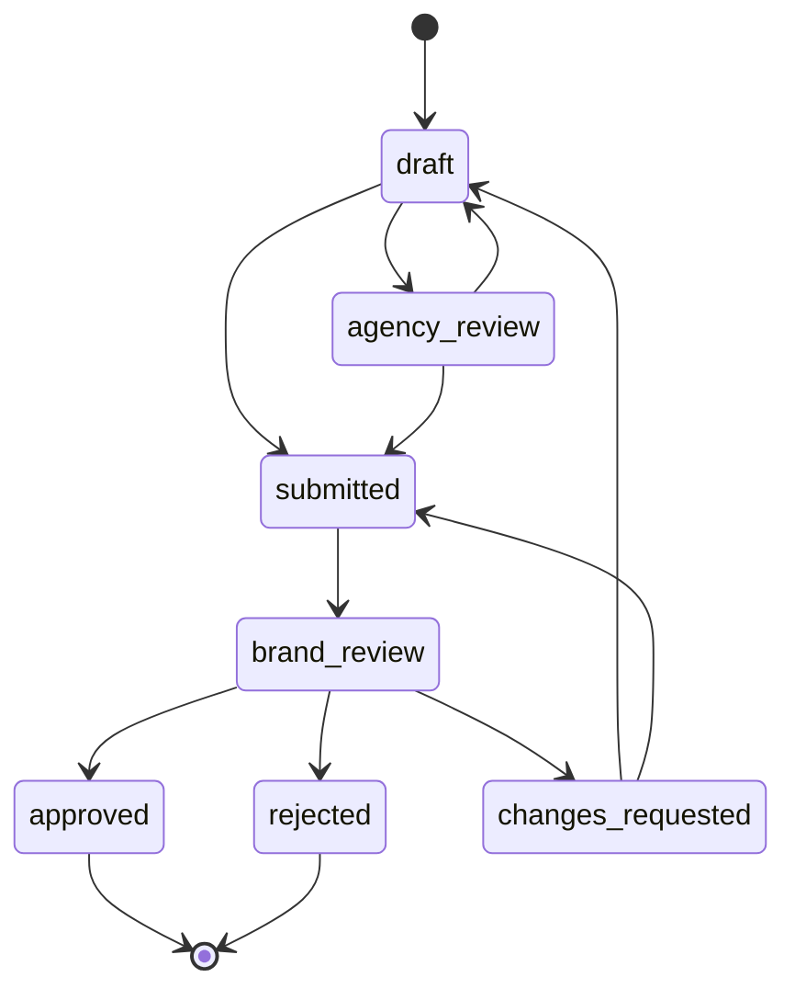
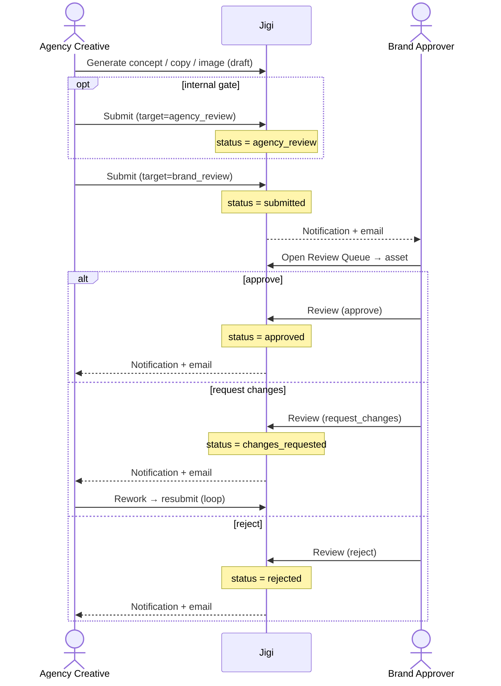

# Flow model (shared)

The vocabulary both persona flows are built on: roles, the asset status machine, and the single handoff where the two personas meet.

## Roles

Source: `uiux/jigi-app/src/lib/roles.ts`

| Role | Reviewer? | Maps to persona |
|------|-----------|-----------------|
| `creator` | no | **Agency Creative** |
| `reviewer` | yes | Agency Creative (internal gate) **or** Brand Approver |
| `approver` | yes | **Brand Approver** |
| `admin` | yes | Brand Approver (+ org admin) |

`isReviewerRole(role)` is `true` for `admin`, `approver`, `reviewer`. It gates `ReviewerRoute` (`/app/review`, `/app/review/:assetId`) and decides whether clicking an in-pipeline asset opens the approval workspace (`shouldOpenAssetReview`).

> The two personas are separated by **role + the statuses they own**, not by separate apps. One deployment serves both.

## Journey modes

Source: `/setup/journey` (`pages/setup/JourneyChoice.tsx`), stored as `users.journey_mode`; campaigns carry `generation_mode`.

- **`brand_first`** — set up a brand, then create campaigns grounded in it.
- **`idea_first`** — start from a raw idea; brand grounding is optional/added later.

Both modes converge on the same generation → submit → review pipeline; only the Agency Creative's *entry* differs.

## Asset status machine

Source: `uiux/jigi-app/src/lib/status.ts` (`STATUS_TRANSITIONS`). This is canonical.

Status ownership by persona:

| Status | Owned by | Meaning |
|--------|----------|---------|
| `draft` | Agency Creative | Being generated / edited |
| `agency_review` | Agency Creative (internal reviewer) | Optional internal gate before it goes to the brand |
| `submitted` | handoff → Brand Approver | Sent to the brand; approvers notified |
| `brand_review` | Brand Approver | Claimed / actively under brand review |
| `changes_requested` | back to Agency Creative | Revisions required; re-enters `draft`/`submitted` |
| `approved` | terminal | Cleared for use |
| `rejected` | terminal | Not approved |

## The single handoff

The two personas only touch at **submit → review**, and only through the enforced endpoints (never direct client status writes).

### Submit — `POST /api/assets/submit`

Source: `server/api/assets/submit.ts`

- Body: `{ asset_id, target: 'agency_review' | 'brand_review', message? }`
- `target: 'agency_review'` → status becomes **`agency_review`** (internal gate).
- `target: 'brand_review'` → status becomes **`submitted`**, and every `admin`/`approver` in the brand's organisation gets an in-app notification + email.
- Permission: caller must belong to the brand org **or** have active `agency_brand_access` to the brand.

### Review — `POST /api/assets/review`

Source: `server/api/assets/review.ts`

- Body: `{ asset_id, action: 'approve' | 'reject' | 'request_changes', notes? }`
- Accepts assets in **`submitted`** or **`brand_review`** (an approver can act straight from `submitted`; moving to `brand_review` first is an optional "I'm looking at this" claim).
- Maps action → status: `approve → approved`, `reject → rejected`, `request_changes → changes_requested`.
- Always notifies the asset's `created_by` (the Agency Creative) in-app + email.

### End-to-end handoff

