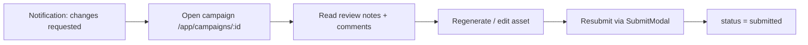

# Persona flow — Agency Creative

## 1. Snapshot

| | |
|---|---|
| **Who** | Agency creative / marketer producing campaign assets for a brand |
| **Role** | `creator` (internal QA may use `reviewer` for the `agency_review` gate) |
| **Primary goal** | Turn a brief/idea into on-brand concept, copy, and imagery, then get it approved |
| **Success metric** | First on-brand asset from brief → `submitted` in one sitting (< ~10 min) |
| **Owns statuses** | `draft`, `agency_review`, `submitted`; reacts to `changes_requested` |

## 2. Entry point & preconditions

- **Authenticated** and belongs to an organisation (`ProtectedRoute requireOrganisation`).
- Has chosen a journey at `/setup/journey` (`brand_first` or `idea_first`).
- For `brand_first`: at least one brand exists (or is created inline).
- Lands on **`/app/dashboard`**; the creator-first dashboard surfaces "start a campaign".

## 3. Ideal (happy) path — brand-first

The shortest path from nothing to a submitted asset.

| # | User action | Route | Component | System response | Status after | Anchor |
|---|-------------|-------|-----------|-----------------|--------------|--------|
| 1 | Pick "Brand-first" | `/setup/journey` | `JourneyChoice` | `journey_mode = brand_first` | — | `journey-choice` |
| 2 | Create / confirm brand | `/app/brands` | `Brands`, `QuickCreateBrandDialog` | Brand saved (identity, voice, strategy, visual style) | — | `brand-create` |
| 3 | Start a campaign | `/app/campaigns/new` | `CampaignCreate`, `BriefForm` | Campaign created with brief + channels | — | `brief-form` |
| 4 | Generate concept | `/app/campaigns/:id` | `GenerationPanel`, `ConceptCard` | On-brand concepts returned + brand-alignment score | `draft` | `generation-panel` |
| 5 | Generate copy | `/app/campaigns/:id` | `GenerationPanel`, `CopyCard` | Copy within channel length limits | `draft` | `generation-panel` |
| 6 | Generate image | `/app/campaigns/:id` | `GenerationPanel`, `ImageCard` | Image using brand palette + visual style | `draft` | `generation-panel` |
| 7 | Check compliance | `/app/campaigns/:id` | `ComplianceDisplay`, `DriftBadge` | Compliance / drift feedback shown | `draft` | `compliance-panel` |
| 8 | Submit for brand review | `/app/campaigns/:id` | `SubmitModal` → `POST /api/assets/submit` (`target=brand_review`) | Status set; approvers notified | `submitted` | `submit-action` |

## 4. Decision branches

- **Idea-first entry** _(optional)_: step 1 picks `idea_first`; step 2 (brand) is skipped or deferred. Generation runs with idea grounding; brand can be attached later. Everything from step 4 onward is identical.
- **Internal agency gate** _(optional)_: before step 8, submit with `target=agency_review` (status → `agency_review`). An internal `reviewer` checks it, then submits onward to the brand. Use when the agency wants a QA pass before the brand sees anything.
- **Iterate before submit**: steps 4–7 loop freely; regeneration and edits stay in `draft`.

## 5. Loop-back path — changes requested

The most-missed cycle. When a Brand Approver requests changes:

- Entry: `NotificationBell` → notification of type `changes_requested`, deep-links to `/app/campaigns/:id`.
- Asset is back in `changes_requested`; editing returns it toward `draft`, resubmitting sets `submitted` again.

## 6. Terminal / success state

- Asset reaches `approved` (see Brand Approver flow).
- Creator sees it in **`/app/approved`** (`ApprovedAssets`, `ApprovedAssetCard`, `AssetDetailModal`) and can open/export it.

## 7. Moments that matter

1. **First on-brand generation (steps 4–6)** — the "wow". If the first concept/image feels off-brand, trust collapses. The tour should slow down and point at the brand-alignment score and visual-style result.
2. **Submit (step 8)** — the commitment moment. Make the `target` choice (internal vs brand) unambiguous.
3. **Changes-requested loop (§5)** — where creators get lost. Surface review notes prominently on return.

## 8. Anchor inventory (this persona)

See [anchor-inventory.md](./anchor-inventory.md) for the full table. Anchors used here: `journey-choice`, `brand-create`, `brief-form`, `generation-panel`, `compliance-panel`, `submit-action`, `notification-bell`, `approved-assets`.
