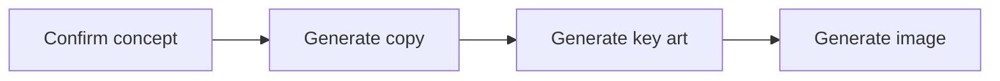
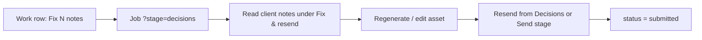

# Persona flow — Agency Creative

## 1. Snapshot

| | |
|---|---|
| **Who** | Agency creative / marketer producing campaign assets for a brand |
| **Role** | `creator` (internal QA may use `reviewer` for the `agency_review` gate) |
| **Primary goal** | Turn a brief/idea into on-brand concept, copy, and imagery, then get it approved |
| **Success metric** | First on-brand asset from brief → `submitted` in one sitting (< ~10 min) |
| **Owns statuses** | `draft`, `agency_review`, `submitted`; reacts to `changes_requested` |

## 2. Entry point & preconditions

- **Authenticated** and belongs to an organisation (`ProtectedRoute requireOrganisation`).
- Has chosen a journey at `/setup/journey` (`brand_first` or `idea_first`).
- For `brand_first`: at least one brand exists (or is created inline).
- Lands on **`/app/work`** (Work home, anchor `work-home`): one row per job with a single next action ("Send for approval", "Fix 2 notes", "3 waiting on client"). `/app/dashboard` redirects here; the old dashboard lives at `/app/overview`.
- Each job opens at `/app/campaigns/:id?stage=…` with the stage rail **Brief → Creative (Concepts · Copy · Images · All candidates) → Send → Decisions → Approved** (anchor `job-stage-rail`) and, on wide screens, the brand + brief context rail (anchor `job-context-rail`).

## 3. Ideal (happy) path — brand-first

The shortest path from nothing to a submitted asset.

| # | User action | Route | Component | System response | Status after | Anchor |
|---|-------------|-------|-----------|-----------------|--------------|--------|
| 1 | Pick "Brand-first" | `/setup/journey` | `JourneyChoice` | `journey_mode = brand_first` | — | `journey-choice` |
| 2 | Create / confirm brand | `/app/brands` or inline on create | `Brands`, `QuickCreateBrandDialog`, `BrandProfile` | Brand saved (identity, voice, strategy, visual style). Profile shows **Preview** sidebar (colours, fonts, tone, visual style, readiness ring) in read mode | — | `brand-create` |
| 3 | Start a campaign | `/app/campaigns/new` | `CampaignCreate` (3-step: Basics → Brief → Channels), `BriefForm` | Campaign created with brief + channels; CCO-lite compiles on save for idea-first | — | `brief-form` |
| 4 | Generate concept | `/app/campaigns/:id` | `GenerationPanel`, `ConceptCard`, `BrandIncompleteBanner` | On-brand concepts returned + brand-alignment score. If brand kit is incomplete, an amber banner warns *Brand profile incomplete — results may drift* with a link to complete the kit | `draft` | `generation-panel` |
| 5 | Generate copy | `/app/campaigns/:id` | `GenerationPanel`, `CopyCard` | Copy within channel length limits | `draft` | `generation-panel` |
| 6 | Generate image | `/app/campaigns/:id` | `GenerationPanel`, `ImageCard` | Image using brand palette + visual style | `draft` | `generation-panel` |
| 7 | Check compliance | `/app/campaigns/:id` | `ComplianceDisplay`, `DriftBadge` | Compliance / drift feedback shown | `draft` | `compliance-panel` |
| 8 | Send for approval | `/app/campaigns/:id?stage=send` | `JobSendStage` (multi-select, *Send to client* / *Internal check first*, optional message) → `POST /api/assets/submit` per asset. Single-asset sends from a card still use `SubmitModal` | Status set; approvers notified; job jumps to **Decisions** | `submitted` → shown as *Waiting on client* | `submit-action` |

## 4. Decision branches

### Production path vs explore (P4)

The default **production path** chains persisted selections — no re-picking after refresh:

```mermaid
flowchart LR
    A[Confirm concept] --> B[Generate copy]
    B --> C[Generate key art]
    C --> D[Generate image]
```

- **Concept → Copy:** ConceptCard *Generate copy* or *Use for copy & visuals* persists `selected_concept_asset_id` and opens the Copy tab.
- **Copy → Images:** CopyCard *Generate key art* persists `selected_copy_asset_id`, sets the messaging anchor, and opens Images.
- **Explore shortcuts:** Concept → image (ConceptCard or detail modal) shows a confirm dialog: *Skip copy? Image may not match final line.* Images tab without a copy anchor shows an amber explore banner.

- **Idea-first entry** _(optional)_: step 1 picks `idea_first`; step 2 (brand) is skipped — use **Quick create brand** inline on create if needed later. Create uses a real **3-step stepper** (Basics → Brief → Channels). Incomplete briefs show a dashboard/list/detail banner: *Brief incomplete — generation may be off-brief*. Incomplete brand kits show a similar banner on the generation panel. Generation runs with idea grounding + CCO-lite; brand can be attached later. Everything from step 4 onward is identical.
- **Internal agency gate** _(optional)_: before step 8, submit with `target=agency_review` (status → `agency_review`). An internal `reviewer` checks it, then submits onward to the brand. Use when the agency wants a QA pass before the brand sees anything.
- **Iterate before submit**: steps 4–7 loop freely; regeneration and edits stay in `draft`.

## 5. Loop-back path — changes requested

The most-missed cycle. When a Brand Approver requests changes:

```mermaid
flowchart LR
    A[Work row: Fix N notes] --> B[Job ?stage=decisions]
    B --> C[Read client notes under Fix & resend]
    C --> D[Regenerate / edit asset]
    D --> E[Resend from Decisions or Send stage]
    E --> F[status = submitted]
```

- Entry: Work home next action (*Fix N notes*) or `NotificationBell` → `changes_requested`, deep-links to the job.
- `JobDecisionsStage` groups work as **Fix & resend** (client notes inline), **Waiting on client**, **Internal check**, **Not moving forward**.
- Asset is back in `changes_requested`; editing returns it toward `draft`, resubmitting sets `submitted` again.

## 6. Terminal / success state

- Asset reaches `approved` (see Brand Approver flow).
- Creator sees it on the job's **Approved** stage (`JobApprovedStage`, download per asset) and globally in **`/app/approved`** (`ApprovedAssets`, `ApprovedAssetCard`, `AssetDetailModal`) and can open/export it.

## 7. Moments that matter

1. **First on-brand generation (steps 4–6)** — the "wow". If the first concept/image feels off-brand, trust collapses. The tour should slow down and point at the brand-alignment score and visual-style result. If the brand kit is incomplete, the generation banner is the cue to finish essentials before heavy iteration.
2. **Submit (step 8)** — the commitment moment. Make the `target` choice (internal vs brand) unambiguous.
3. **Changes-requested loop (§5)** — where creators get lost. Surface review notes prominently on return.

## 8. Anchor inventory (this persona)

See [anchor-inventory.md](./anchor-inventory.md) for the full table. Anchors used here: `work-home`, `job-stage-rail`, `job-context-rail`, `journey-choice`, `brand-create`, `brief-form`, `generation-panel`, `compliance-panel`, `submit-action`, `notification-bell`, `approved-assets`.

## 9. Status language (UI)

Raw statuses never appear in creator UI. `src/lib/handoff/human-status.ts` maps them:

| Status | Creator sees | Client sees |
|---|---|---|
| `draft` | Working | Working |
| `agency_review` | Internal check | Internal check |
| `submitted` / `brand_review` | Waiting on client | Needs your decision |
| `changes_requested` | Fix & resend | You asked for changes |
| `approved` | Approved | Approved |
| `rejected` | Not moving forward | Declined |
