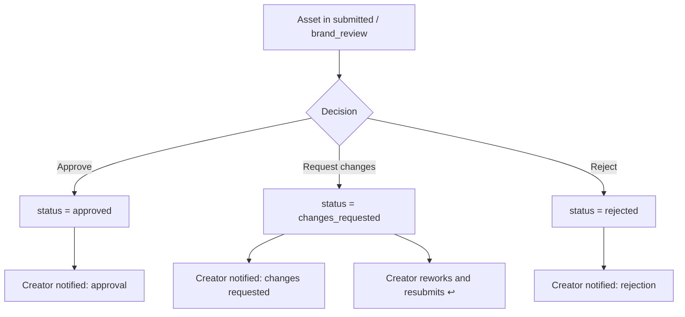

# Persona flow — Brand Approver

## 1. Snapshot

| | |
|---|---|
| **Who** | Brand-side stakeholder responsible for on-brand sign-off |
| **Role** | `approver` (also `admin`; `reviewer` for internal gate) — all pass `isReviewerRole` |
| **Primary goal** | Quickly judge whether submitted creative is on-brand and act on it |
| **Success metric** | From notification → decision with minimal clicks; clear audit trail |
| **Owns statuses** | `brand_review` → `approved` / `rejected` / `changes_requested` (acts from `submitted` too) |

## 2. Entry point & preconditions

- Authenticated, belongs to the brand's organisation, and passes `isReviewerRole` (else `ReviewerRoute` redirects).
- At least one asset has been submitted (`status = submitted`) for a brand in the approver's org.
- Typical entry is a **notification** (in-app `NotificationBell` + email), deep-linking to `/app/review/:assetId`.

## 3. Ideal (happy) path

| # | User action | Route | Component | System response | Status after | Anchor |
|---|-------------|-------|-----------|-----------------|--------------|--------|
| 1 | Open notification | any `/app/*` | `NotificationBell`, `NotificationDropdown` | Deep-links to the submitted asset | `submitted` | `notification-bell` |
| 2 | Open review queue | `/app/review` | `ReviewQueue`, `ReviewQueueCard` | Lists everything awaiting brand review | `submitted` | `review-queue` |
| 3 | Open an asset | `/app/review/:assetId` | `AssetReview`, `AssetPreviewArea` | Full-fidelity preview loads | `submitted` (→ `brand_review` if claimed) | `asset-preview` |
| 4 | Inspect details | `/app/review/:assetId` | `AssetDetailsSidebar`, `ComplianceDisplay`, `StatusHistoryTimeline` | Brief, brand context, compliance, history shown | — | `asset-details` |
| 5 | Discuss _(optional)_ | `/app/review/:assetId` | `CommentsSidebar`, `CommentThread` | Threaded comments captured | — | `comments-sidebar` |
| 6 | Decide | `/app/review/:assetId` | `ReviewActions` + `ApproveModal` / `RejectModal` / `RequestChangesModal` → `POST /api/assets/review` | Status updated; creator notified; audit rows written | `approved` \| `rejected` \| `changes_requested` | `review-actions` |

Keyboard shortcuts exist for the three actions (`a` approve, `x` reject, `r` request changes — see `REVIEW_ACTIONS`).

## 4. Decision branches

The single decision node, from `ReviewActions`:

- **Approve** → terminal `approved`; appears in the creator's `/app/approved`.
- **Request changes** → `changes_requested`; hands back to the Agency Creative loop-back path.
- **Reject** → terminal `rejected`; not recoverable through the standard loop.

Every action writes to `asset_status_history` **and** `approval_actions` for a full audit trail, and sets `reviewed_by` / `reviewed_at`.

## 5. Loop-back / re-review

After `changes_requested`, the creative reworks and resubmits (`submitted` again). The asset reappears in the approver's Review Queue (step 2). `StatusHistoryTimeline` shows the prior round so the approver has context on the second pass.

## 6. Terminal / success state

- Decision recorded; creator notified in-app + email.
- Approved assets are discoverable org-wide via `/app/approved`.

## 7. Moments that matter

1. **Notification → asset (steps 1–3)** — speed to the decision surface is the whole value prop for approvers. Minimize clicks; the deep link should land directly on the asset.
2. **Confidence to decide (step 4)** — compliance + brand context + history must be visible without hunting, or approvers stall.
3. **Request-changes clarity (step 6)** — notes here become the creator's to-do list; the tour should stress writing actionable notes.

## 8. Anchor inventory (this persona)

See [anchor-inventory.md](./anchor-inventory.md) for the full table. Anchors used here: `notification-bell`, `review-queue`, `asset-preview`, `asset-details`, `comments-sidebar`, `review-actions`.
